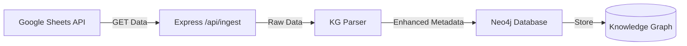
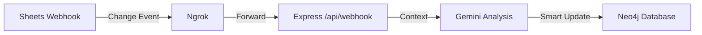

spreadsheet-brain/
├── src/
│ ├── modules/
│ │ └── ingest.ts
│ └── index.ts
├── docs/
│ ├── architecture.md
│ ├── api.md
│ └── setup.md
├── .env.example
├── .gitignore
└── README.md

# Architecture Overview

## System Components

### Spreadsheet Ingestion with AI Enhancement



### Real-time Updates with AI Processing



### Natural Language Query Processing


## Data Model

### Node Types

- **Table**: Represents a logical group of data
  - Properties: `{name: string}`
- **Column**: Header information
  - Properties: `{name: string}`
- **Row**: Data row container
  - Properties: `{id: string}`
- **Cell**: Individual data point
  - Properties: `{id: string, raw_value: string}`
- **Formula**: Mathematical/logical expressions
  - Properties: `{expression: string}`
- **Constant**: Static values
  - Properties: `{value: string}`

### Relationships

- `[:BELONGS_TO]`: Cell → Table
- `[:HAS_CELL]`: Row → Cell
- `[:HAS_COLUMN]`: Cell → Column
- `[:USES_FORMULA]`: Cell → Formula
- `[:DEPENDS_ON]`: Formula → Cell
- `[:HAS_VALUE]`: Cell → Constant# API Documentation

## Endpoints

### Ingest Spreadsheet

```http
POST /api/ingest
Content-Type: application/json

{
    "spreadsheetId": "string"
}
```

### Webhook Handler

```http
POST /api/webhook
Content-Type: application/json

// Google Sheets webhook payload
```

## Data Structures

### Block Interface

```typescript
interface Block {
  headerRowIndex: number;
  dataRows: number[];
}
```

### Response Format

```json
{
    "status": "success|error",
    "message": "string",
    "data?: any"
}
```


Show all revenue cells connected to Product B"
If I change this formula =N28*O28, what downstream cells/tables are impacted?